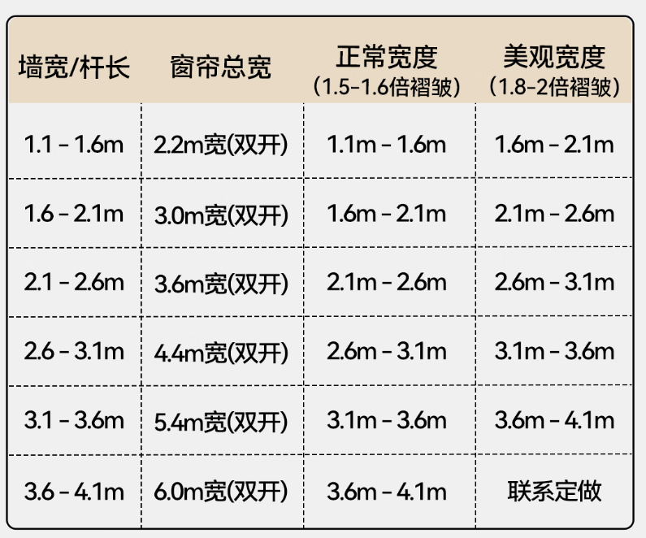
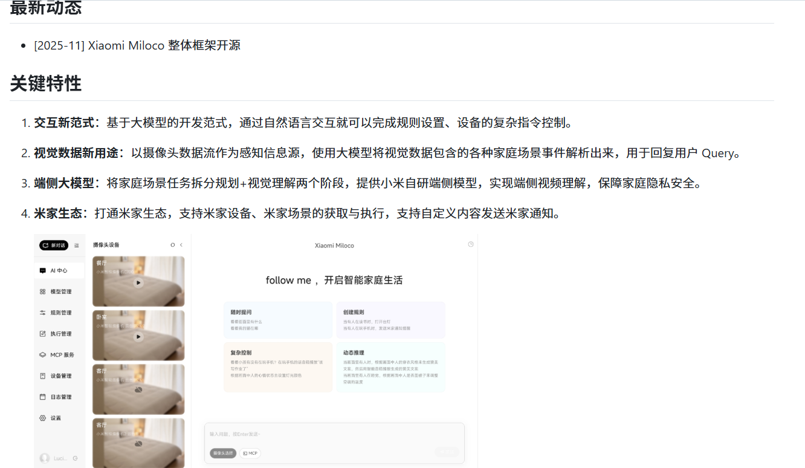

小米智能窗帘 713 扩展每米69
https://item.jd.com/100117947280.html
声音：降噪
控制方式：语音，远程，定时，遥控器，手动 可直接接入小米生态
单轨0-3米，有扩展包可延长至5米，可选单开双开（建议双开）
轨道材质：铝合金
供电方式：直接接入电源
安装：工程师上门

窗帘 330 双开
https://item.jd.com/100101836713.html#switch-sku
宽度:6m 正常宽度 300*250/270 2片

挂钩6.5cm

小米智能音箱pro 299
https://item.jd.com/100169940120.html

小米漏水传感器 69
https://item.jd.com/10197882834769.html
检测高度 地面0.5mm或顶部聚水
可接入智能网络

智能开关 129
https://item.jd.com/100191630530.html

小米miloco 本地人工智能模型 结合摄像头
https://github.com/XiaoMi/xiaomi-miloco/blob/main/README_zh_Hans.md
通过视觉技术可以分析危险源（漏水，火灾）及危险动作（处于激光直射范围）
