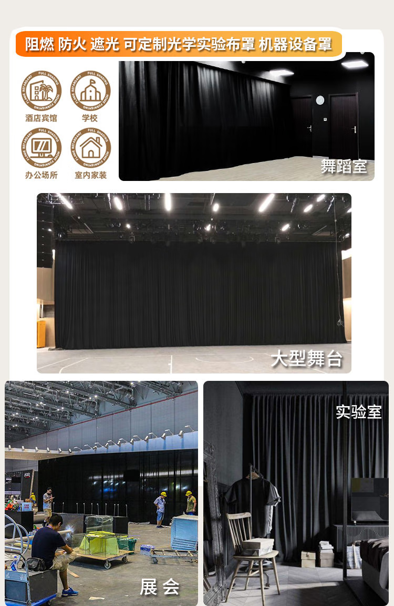
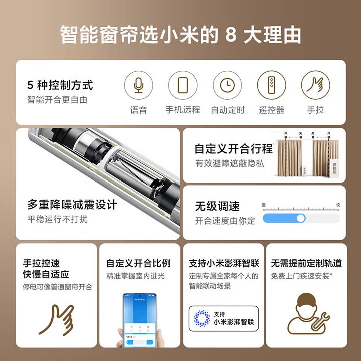
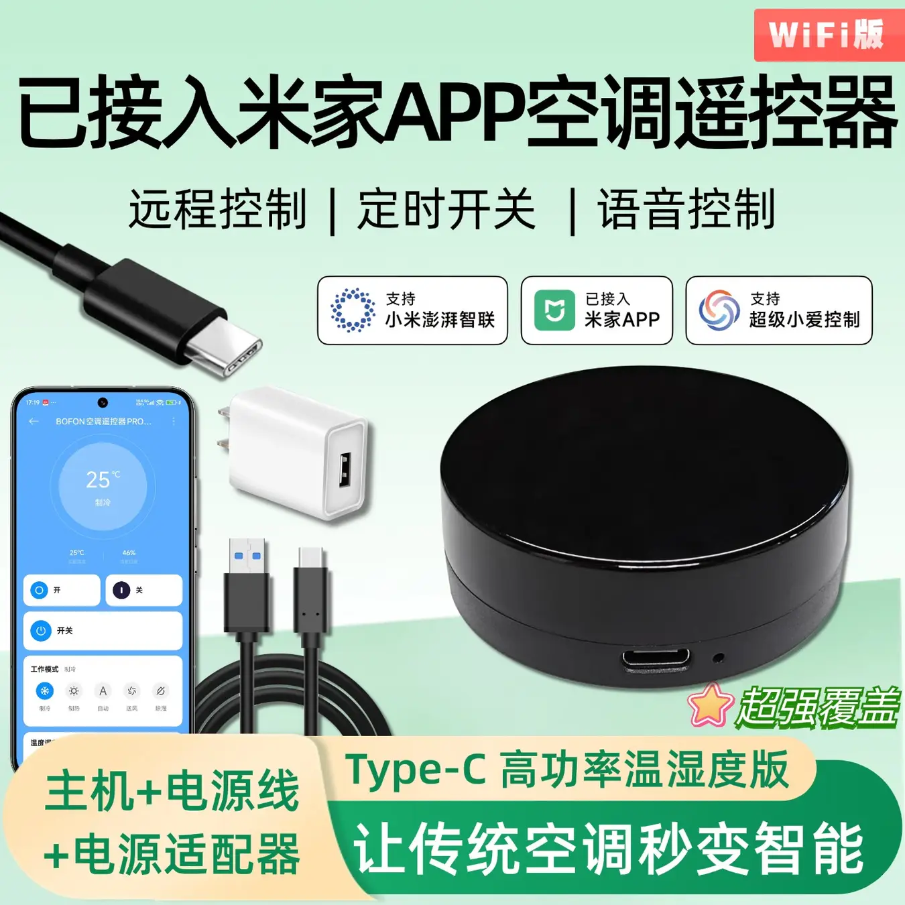
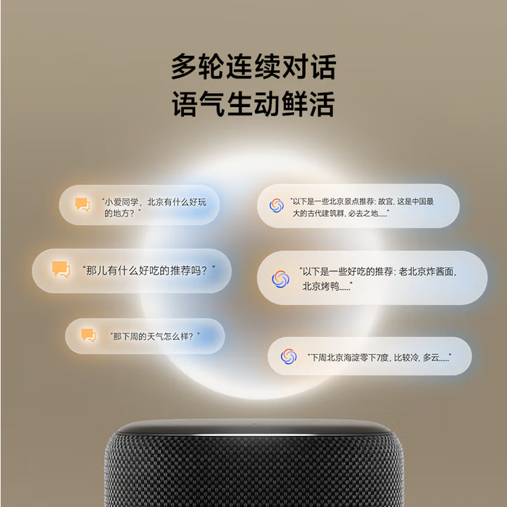

<table class="no-border-table">
  <thead>
    <tr>
      <th>分类</th>
      <th>产品名称</th>
      <th>规格/备注</th>
      <th>单价 (元)</th>
      <th>数量</th>
      <th>小计 (元)</th>
    </tr>
  </thead>
  <tbody>
    <tr>
      <td><b>中央控制</b></td>
      <td>小米智能音箱 Pro</td>
      <td>语音控制中心</td>
      <td>299</td>
      <td>1</td>
      <td>299</td>
    </tr>
    <tr>
      <td><b>遮光/环境</b></td>
      <td>智能窗帘电机+轨道</td>
      <td>基础版 (0-3米)</td>
      <td>713</td>
      <td>1</td>
      <td>713</td>
    </tr>
    <tr>
      <td></td>
      <td>轨道扩展包</td>
      <td>延长至5米 (每米69元)</td>
      <td>69</td>
      <td>1</td>
      <td>69</td>
    </tr>
    <tr>
      <td></td>
      <td>窗帘布料</td>
      <td>双开 </td>
      <td>206</td>
      <td>2</td>
      <td>412</td>
    </tr>
    <tr>
      <td><b>温控</b></td>
      <td>米家智能红外遥控器</td>
      <td>温湿度版，传统空调变智能</td>
      <td>52.8</td>
      <td>2</td>
      <td>105.6</td>
    </tr>
    <tr>
      <td><b>照明</b></td>
      <td>智能开关 (单开)</td>
      <td>替换原有开关</td>
      <td>129</td>
      <td>1</td>
      <td>129</td>
    </tr>
    <tr>
      <td></td>
      <td>智能开关 (三开)</td>
      <td>替换原有开关</td>
      <td>169</td>
      <td>1</td>
      <td>169</td>
    </tr>
    <tr>
      <td><b>安防/监控</b></td>
      <td>小米智能摄像机4 变焦版</td>
      <td>视觉信息源，支持 Miloco</td>
      <td>314</td>
      <td>1</td>
      <td>314</td>
    </tr>
    <tr>
      <td></td>
      <td>小米水浸卫士</td>
      <td>监测0.5mm积水</td>
      <td>69</td>
      <td>1</td>
      <td>69</td>
    </tr>
    <tr>
      <td><b>总计</b></td>
      <td></td>
      <td><b>硬件与基础服务总投入</b></td>
      <td></td>
      <td></td>
      <td><b>2,279.6 元</b></td>
    </tr>
  </tbody>
</table>

小米智能窗帘 713 扩展每米69 应该是需要扩展一米
https://item.jd.com/100117947280.html
声音：降噪
控制方式：语音，远程，定时，遥控器，手动 可直接接入小米生态
单轨0-3米，有扩展包可延长至5米，可选单开双开（建议双开）
轨道材质：铝合金
供电方式：直接接入电源
安装：工程师上门

::: note 弃用
窗帘 330 双开
https://item.jd.com/100101836713.html#switch-sku
宽度:6m 正常宽度 300*250/270 2片
挂钩6.5cm
:::

阻燃窗帘 2*206
https://item.jd.com/10147775844449.html#switch-sku

小米智能音箱pro 299
https://item.jd.com/100169940120.html

米家智能红外空调遥控器 52.8 ？*2 如果遮挡可能需要两个
https://item.jd.com/10192769108170.html

小米漏水传感器 69
https://item.jd.com/10197882834769.html
检测高度 地面0.5mm或顶部聚水
可接入智能网络

智能开关 单开129* 1+三开169*1
https://item.jd.com/100191630530.html

小米摄像头4 314
https://item.jd.com/100268403028.html

小米miloco 本地人工智能模型 结合摄像头
https://github.com/XiaoMi/xiaomi-miloco/blob/main/README_zh_Hans.md
通过视觉技术可以分析危险源（漏水，火灾）及危险动作（处于激光直射范围）

