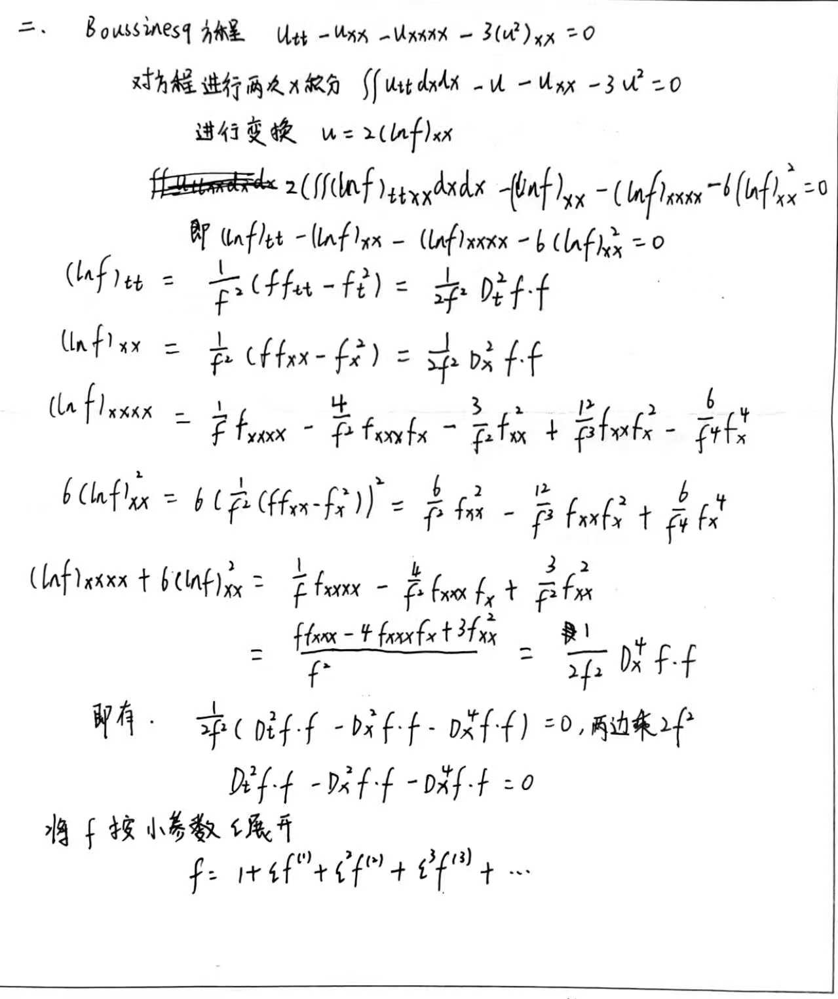
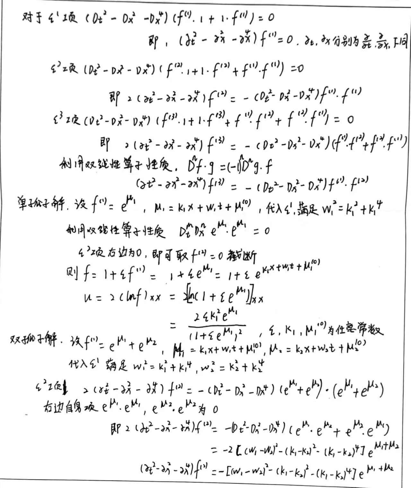

双线性算子定义为：
$$D^m_tD^n_xf(t,x)\cdot g(t,x)=\frac{\partial^m}{\partial t_0^m}\frac{\partial^n}{\partial x_0^n}f(t+t_0,x+x_0)\cdot g(t-t_0,x-x_0)|_{s_0=0,t_0=0}
$$



```python :line-number
import matplotlib.animation as animation
import matplotlib.pyplot as plt
import matplotlib as mpl
import numpy as np
from IPython.display import display
from sympy import *
x, t = symbols('x,t')
k1, k2, w1, w2, xi1, xi2, epsilon, xi10, xi20, a = symbols('k_1,k_2,w_1,w_2,xi_1,xi_2,epsilon,xi_1^0,xi_2^0,a_{12}')

z1 = k1 * x + w1 * t + xi10
z2 = k2 * x + w2 * t + xi20
a12 = (-((w1 - w2) ** 2 - (k1 - k2) ** 2 - (k1 - k2) ** 4)) / ((w1 + w2) ** 2 - (k1 + k2) ** 2 - (k1 + k2) ** 4)
f = 1 + epsilon * (E ** z1 + E ** z2) + epsilon ** 2 * a12 * E ** (z1 + z2)

eq1 = Eq(w1 ** 2, k1 ** 2 + k1 ** 4)
eq2 = Eq(w2 ** 2, k2 ** 2 + k2 ** 4)

u_plot = 2 * diff(log(f), x, 2)

u = u_plot.subs(epsilon, 1).subs({w1: solve(eq1, w1)[1], w2: solve(eq2, w2)[1]}).subs({k1: 1, k2: 2, xi10: 0, xi20: 10})
display(u.simplify())
mpl.use('TKAgg')
u_data = lambdify([x, t], u)
x_domain = np.linspace(-50, 50, 1000)
line, = plt.plot(x_domain, u_data(x_domain, 0))  # 初始t=0的曲线

def update(t_val):
    line.set_ydata(u_data(x_domain,t_val))
    return line,

ani=animation.FuncAnimation(plt.gcf(), update,np.linspace(0,100,100),interval=100)
plt.show()
```


